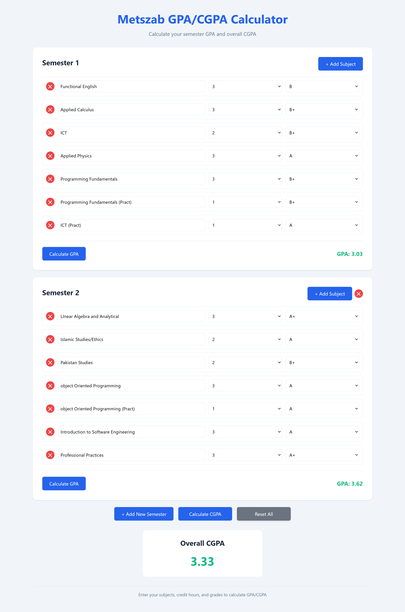

# GPA/CGPA Calculator

 

A modern, responsive GPA and CGPA calculator web application for students to track their academic performance across multiple semesters.

## Features

- 📊 Calculate both GPA (per semester) and CGPA (cumulative)
- ➕ Add/remove semesters dynamically
- 📝 Add/remove subjects with credit hours and grades
- 🎨 Clean, intuitive UI with responsive design
- 📱 Mobile-friendly interface

## Technologies Used
- **Frontend**: HTML5, CSS3, JavaScript
- **Styling**: Modern CSS with variables
- **Responsive Design**: Mobile-first approach

## Usage

1. Add semesters using the "+ Add New Semester" button
2. For each semester:
   - Add subjects with the "+ Add Subject" button
   - Enter subject name, credit hours, and grade
   - Click "Calculate GPA" to see semester results
3. Click "Calculate CGPA" to see your cumulative GPA

## File Structure
index.html # Main HTML file  
styles.css # CSS styles  
script.js # JavaScript functionali  
screenshot.png # Project screenshot  

Project Link: [https://github.com/your-username/gpa-calculator](https://github.com/your-username/gpa-calculator)
